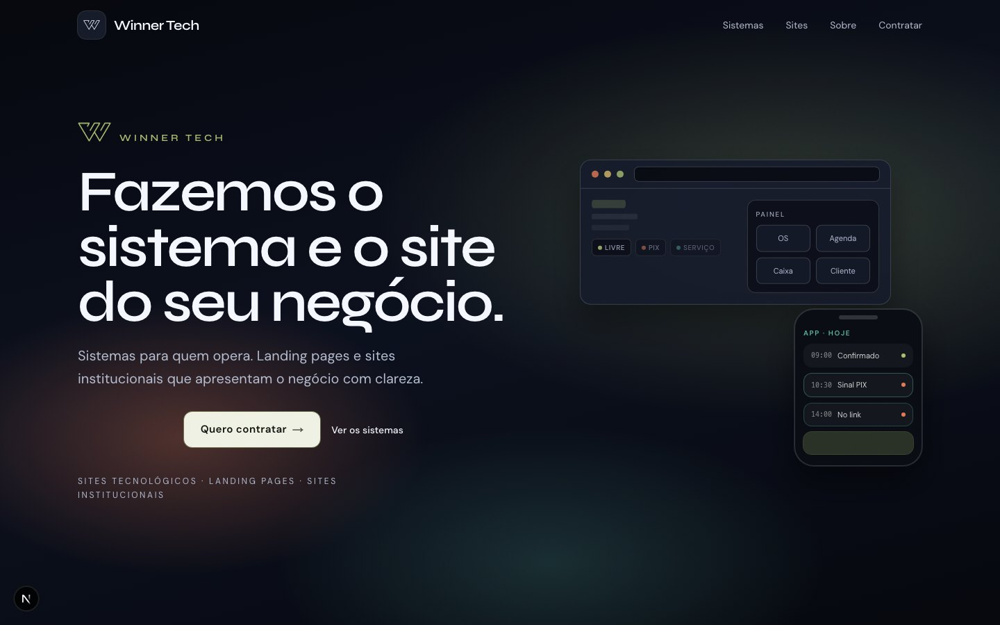
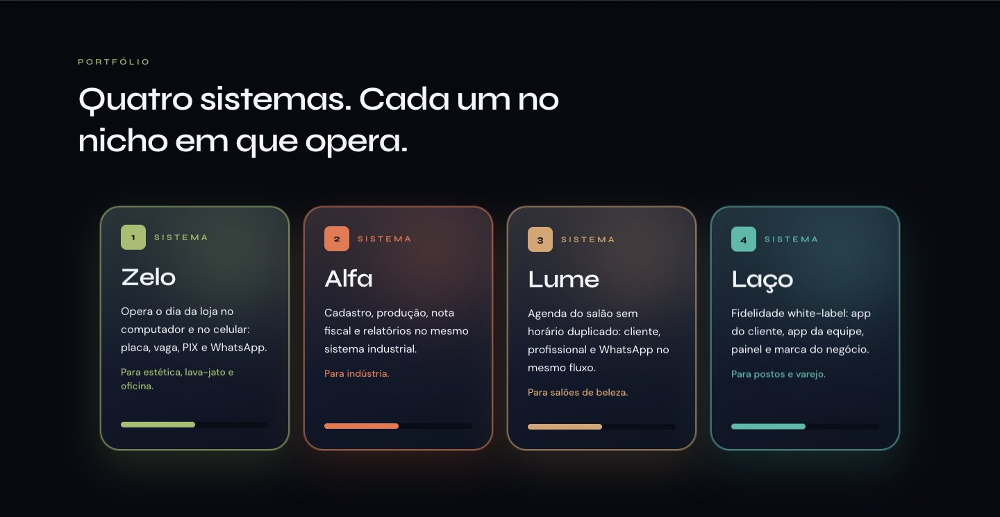

# Winner Tech

Site institucional da Winner Tech. Apresenta os sistemas próprios da empresa (Zelo, Alfa, Lume e Laço), a oferta de sites e landing pages sob medida, e leva o visitante a iniciar uma conversa pelo WhatsApp.

O site é uma vitrine. Os produtos continuam nos próprios repositórios e ambientes; nada deles é reimplementado aqui.



<table>
  <tr>
    <td width="50%"></td>
  </tr>
</table>


## O que o site mostra

- **Hero** com a oferta principal: sistema e site do negócio do cliente.
- **Sistemas**, cada um com função e nicho:
  - **Zelo**: operação da loja (placa, vaga, PIX, WhatsApp). Estética, lava-jato e oficina.
  - **Alfa**: cadastro, produção, nota fiscal e relatórios. Indústria.
  - **Lume**: agenda sem horário duplicado. Salões de beleza.
  - **Laço**: fidelidade white-label com app do cliente, app da equipe e painel. Postos e varejo.
- **Sites e landings**: oferta de landing de produto e site institucional.
- **Cases**: Brasil Estética (cliente do Zelo), Alfa Papéis e Frutmix (clientes do Alfa) e Posto Marinheiro (cliente do Laço).
- **Prova aprovada**: depoimentos e métricas só aparecem quando marcados com `approved: true`. Lista vazia significa seção omitida.
- **Discovery por nicho**: `/para/loja-automotiva`, `/para/salao`, `/para/industria`, `/para/fidelidade`.
- **Sobre**: `/sobre`.
- **CTA de contratação**: abre o WhatsApp com mensagem pré-preenchida por produto e registra a origem do clique.

## Stack

- [Next.js](https://nextjs.org) 16 (App Router) e React 19
- TypeScript
- Tailwind CSS 4
- GSAP + ScrollTrigger e Lenis (scroll e motion)
- Three.js, React Three Fiber e drei (cena WebGL do hero)
- `next/font` com Syne e DM Sans

Sem CMS, banco de dados ou autenticação. O conteúdo fica em código.

## Rodando localmente

Requer Node.js 20.9 ou superior.

```bash
npm install
npm run dev
```

Abra [http://localhost:3000](http://localhost:3000).

Outros comandos:

```bash
npm run build   # build de produção
npm run start   # serve o build
npm run lint    # ESLint
```

## Variáveis de ambiente

Copie `.env.example` para `.env.local`.

| Variável | Descrição |
|----------|-----------|
| `NEXT_PUBLIC_SITE_URL` | Origem pública do site (canonical, sitemap, robots, Open Graph). Padrão: `https://winnertech.com.br`. |
| `NEXT_PUBLIC_GA_MEASUREMENT_ID` | ID de medição do GA4 (`G-XXXXXXXXXX`). Vazio desativa o carregamento do gtag. |
| `NEXT_PUBLIC_META_PIXEL_ID` | ID do Meta Pixel (só dígitos). Vazio desativa o pixel. |

Em produção, defina `NEXT_PUBLIC_GA_MEASUREMENT_ID` (e o pixel, se houver anúncios). Sem isso o evento é emitido, mas nada é medido.

## Estrutura

```
app/
  page.tsx                 home
  sobre/page.tsx           página Sobre
  para/[slug]/page.tsx     discovery por nicho (SSG)
  opengraph-image.tsx      imagem OG
components/                seções, header, footer, CTA, cena do hero
lib/
  site.ts                  URL, título e descrição do site
  content.ts               produtos, nichos, cases, textos, prova aprovada
  whatsapp.ts              link do WhatsApp e evento de analytics
public/brand/              marca gráfica
.planning/                 planejamento do projeto (GSD)
```

## Editando conteúdo

- Produtos, nichos, cases e textos: `lib/content.ts`.
- Prova social: adicione itens em `APPROVED_PROOF` com `approved: true`, somente com texto aprovado pelo responsável.
- Número e mensagem do WhatsApp: `lib/content.ts` e `lib/whatsapp.ts`.

## Analytics

O clique em "Quero contratar" dispara o evento `hire_whatsapp_click` com o parâmetro `origin` (seção ou nicho de onde veio). O evento vai para `window.dataLayer` e, se o GA4 estiver configurado, para o `gtag`. Com o Meta Pixel configurado, o mesmo clique dispara o evento padrão `Contact`. O clique é capturado no código (`lib/whatsapp.ts`), sem depender de GTM.

## Segurança e qualidade

- Headers de segurança em `next.config.ts` (`X-Frame-Options`, `X-Content-Type-Options`, `Referrer-Policy`, `Permissions-Policy`, HSTS). O HSTS só vale sob HTTPS. Sem CSP por enquanto, por causa do GA4.
- Dados estruturados (JSON-LD, `Organization` e `WebSite`) no layout, gerados em `lib/site.ts`.
- CI em `.github/workflows/ci.yml`: `npm run typecheck`, `npm run lint` e `npm run build` a cada push e pull request.

## Privacidade e cookies (LGPD)

- GA4 e Meta Pixel só carregam depois do aceite no banner de cookies (`components/cookie-banner.tsx`, `components/analytics.tsx`). A escolha fica no `localStorage`.
- O banner e o botão "Gerenciar cookies" do footer só existem quando `NEXT_PUBLIC_GA_MEASUREMENT_ID` ou `NEXT_PUBLIC_META_PIXEL_ID` estão definidos.
- Política em `/privacidade`. Revise o texto com o jurídico antes de publicar.

## SEO e compartilhamento

- Metadata nativa do App Router em `app/layout.tsx`, com Open Graph, Twitter card e canonical. O card do WhatsApp usa `app/opengraph-image.tsx`.
- `app/sitemap.ts` e `app/robots.ts` geram `/sitemap.xml` e `/robots.txt`, incluindo as páginas de nicho.
- Textos centrais em `lib/site.ts`.

## Performance

Lighthouse mobile (build de produção, 4G com CPU 4x mais lenta): Performance 94, Acessibilidade 100, Boas práticas 100, SEO 100. Em mobile o scroll é nativo (sem Lenis), o overlay de grão fica só no desktop e os loops infinitos do hero pausam fora da tela.

## Acessibilidade e motion

Animações respeitam `prefers-reduced-motion`. Apenas `transform` e `opacity` são animados.

Links que abrem em nova aba (WhatsApp, cases) avisam leitores de tela. Links só com ícone têm `aria-label`.

Imagens usam `next/image`, que aplica lazy loading por padrão. As imagens do site ficam abaixo da primeira dobra; o hero é WebGL, então não há imagem com `priority`.

## Deploy

Pensado para Vercel ou qualquer host Node com `next start`. Não usar `output: 'export'`, para manter a otimização de imagens do `next/image`.

## Contato

WhatsApp: +55 62 99828-6169
